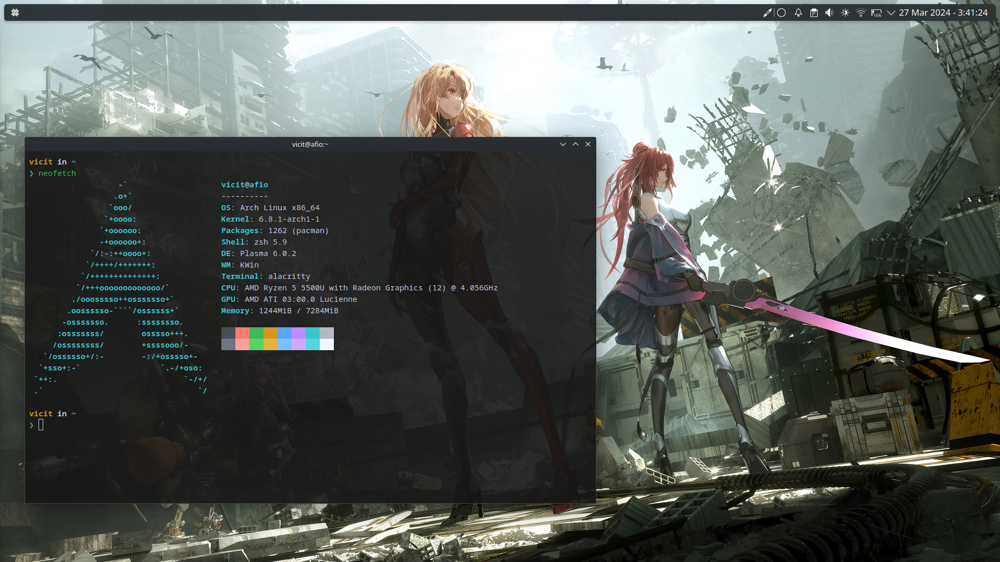

# Script de instalação para Arch Linux

<small>
  Este é um guia de instalação simples e rápida do Arch Linux, acompanhado de um script para instalar uma interface gráfica e um conjunto abrangente de ferramentas para o seu dia a dia. Com esta abordagem, você pode realizar uma instalação rápida sem   a necessidade de gastar muito tempo baixando ou configurando componentes iniciais.</br></br>
  É importante destacar que este script não personaliza a interface, mas oferece um pacote de wallpapers para adicionar um toque de personalização. Sinta-se à vontade para explorar e se divertir com eles! No entanto, para uma experiência mais completa e alinhada às suas preferências, recomendo pesquisar e estudar mais a fundo sobre a interface gráfica e o ecossistema que deseja montar dentro do seu sistema.</br></br>
  Ao seguir este guia, você estará no caminho para uma instalação eficiente do Arch Linux, com acesso rápido a uma variedade de ferramentas e recursos para facilitar o seu dia a dia. Vamos começar!
</small>

***
<details>
  <summary><strong>🚀 Guia de Instalação Rápida do Arch Linux</strong></summary>
  
  ### Configuração do Teclado
  1. Lista os layouts disponíveis para vocês escolher qual se adequa ao seu teclado:
     
    localectl list-keymaps
    
  2. Carregue a configuração para o teclado (exemplo para ABNT2):
     
    loadkeys br-abnt2
    
  ### Configuração de Região e Idioma (Opcional)
  1. Abra o arquivo de configuração de localidades para edição:
 
    nano /etc/locale.gen

  <blockquote>
    Remova o “#” na frente da linha do idioma da sua escolha por exemplo: #pt_BR.UTF-8 UTF-8 > pt_BR.UTF-8 UTF-8 . Após isso use os atalhos CTRL+O e aperte ENTER depois CTRL+X e aperte ENTER.
  </blockquote>
    
  2. Gera as localidade definida no arquivo /etc/locale.gen:

    locale-gen

  3. Define o idioma padrão do sistema (exemplo para pt-br):

    export LANG=pt_BR.UTF-8

  ### Atualizar o relógio do sistema
  
  1. Ativa a sincronização automática de hora e data pela rede utilizando NTP (Network Time Protocol).

    timedatectl set-ntp true
      
  2. Verificando mudança na configuração de hora e data:

    timedatectl status

  ### Modo de inicialização
  
  1. Verifica se o sistema utiliza UEFI (mais moderno), o que é importante para alguns ajustes posteriores.

    ls /sys/firmware/efi/efivars

  2. Verifique o número de bits do UEFI:

    cat /sys/firmware/efi/fw_platform_size

  ### Configuração de Rede sem Fio

  <blockquote>
    Para instalar o Arch Linux precisa ter conexão via Wi-Fi ou Ethernet. Siga as instruções abaixo para caso queira usar internet sem fio.
  </blockquote>
  
  1. Liste as interfaces de rede disponíveis no sistema:

    ip link

  2. Ativa a interface de rede especificada (por exemplo, `ip link set wlan0 up` para ativar a rede sem fio):

    sudo rfkill unblock wifi && ip link set {interface} up

  <blockquote>
    Aqui estamos desbloqueando a placa de rede e ativando ela… Não esqueça de trocar “{interface}” pela sua placa de rede.
  </blockquote>
  
  3. Inicie a ferramenta de configuração de rede sem fio:

    iwctl

  4. Liste os dispositivos de rede sem fio disponíveis:

    device list

  5. Faz uma busca por redes sem fio disponíveis na interface escolhida (por exemplo, `station wlan0 scan`  para busca na rede sem fio):

    station {interface} scan

  6. Mostra as redes da busca anterior:

    station {interface} get-networks

  7. Conecta à rede sem fio especificada pelo SSID:

    station {interface} connect SSID

  <blockquote>
    Vai abrir um campo no console para preencher com a senha da rede.
  </blockquote>
  
  8. Mostra detalhes da conexão atual na interface:

    station {interface} show

  9. Saia do iwctl:

    exit

  <p>Em seguida teste a rede:</p>
  
    ping -c 5 archlinux.org

  ### Instalação
  
  1. O arch linux tem um script de instalação intuitivo ([https://archinstall.archlinux.page/](https://archinstall.archlinux.page/)):

    archinstall
    
  <blockquote>
    No perfil escolha o tipo MINIMAL.
  </blockquote>
    
  
  
</details>

***
<details>
  <summary><strong>💻 Instalação do ambiente desktop</strong></summary>
  
  <blockquote>
    Ao reiniciar o sistema, verifique se está conectado à internet e siga os passos abaixo.
  </blockquote>

  1. Baixe o script de inicialização:
     
    sh -c "$(curl -fsSL https://raw.githubusercontent.com/afiovinicius/dotfiles/main/init-setup)"

</details>

***
<details>
  <summary><strong>🗂️ Estrutura</strong></summary>
  
 ```
|—— files
|    |—— assets
|        |—— icon-menu.png
|        |—— set-wallpaper.sh
|        |—— setup.jpg
|        |—— wallpapers
|            |—— bg-01.jpg
|            |—— bg-02.jpg
|            |—— bg-03.jpg
|            |—— bg-04.jpg
|            |—— bg-05.jpg
|            |—— bg-06.jpg
|            |—— bg-07.jpg
|            |—— bg-08.jpg
|            |—— bg-09.jpg
|            |—— bg-10.jpg
|            |—— bg-11.jpg
|            |—— bg-12.jpg
|            |—— bg-13.jpg
|            |—— bg-14.jpg
|            |—— bg-15.jpg
|            |—— bg-16.jpg
|            |—— bg-17.jpg
|            |—— bg-18.jpg
|            |—— bg-19.jpg
|            |—— bg-20.jpg
|    |—— config
|        |—— alacritty
|            |—— alacritty.toml
|            |—— themes
|                |—— vicit.toml
|        |—— neofetch
|            |—— config.conf
|        |—— nvim
|            |—— .stylua.toml
|            |—— LICENSE
|            |—— README.md
|            |—— init.lua
|            |—— lua
|                |—— chadrc.lua
|                |—— configs
|                    |—— conform.lua
|                    |—— lazy.lua
|                    |—— lspconfig.lua
|                |—— mappings.lua
|                |—— options.lua
|                |—— plugins
|                    |—— init.lua
|        |—— zsh
|            |—— .zshenv
|            |—— .zshrc
|    |—— kde
|        |—— install.sh
|—— scripts
|    |—— configs-desktop.sh
|    |—— configs-system.sh
|    |—— ecosystem.sh
|    |—— utils.sh
|—— .gitignore
|—— init-setup
|—— setup.sh
```
</details>

***

# 🏅 Setup


