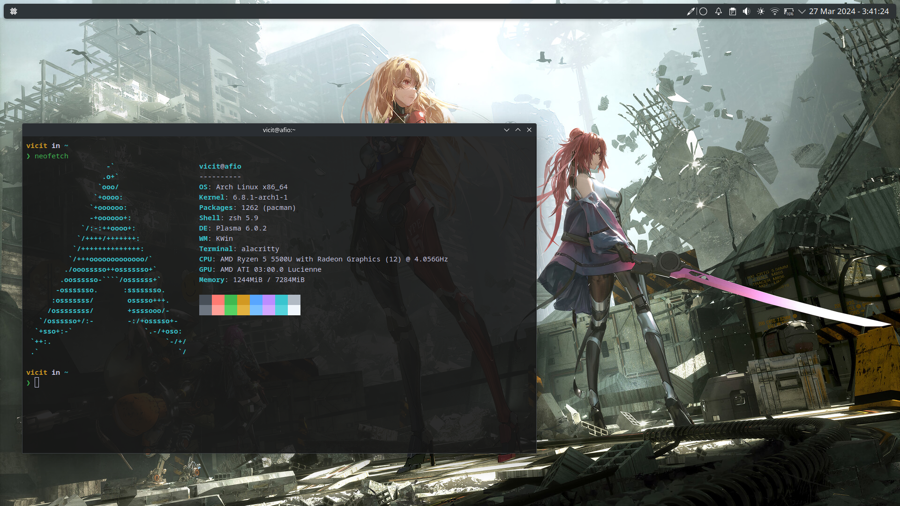
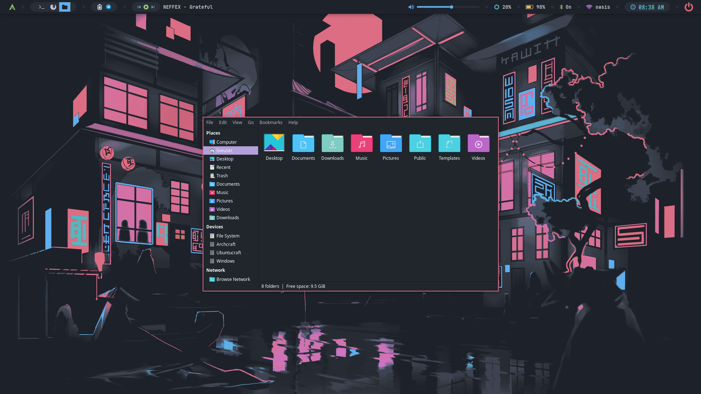

# Afio Arch

[](https://archlinux.org)
[](https://fishshell.com)

Este é uma base de instalação simples e rápida do Arch Linux, acompanhado de ferramentas auxiliares para instalar e configurar uma interface gráfica, um conjunto abrangente de pacotes que cobre áreas como jogos, programação, design & 3D, IoT e a base para seu SO. Com esta abordagem, você pode realizar uma instalação rápida sem a necessidade de gastar muito tempo baixando ou configurando componentes iniciais com acesso rápido a uma variedade de ferramentas e recursos para facilitar o seu dia a dia.

É importante destacar que a personalização da interface é mínima, para uma experiência mais completa e alinhada às suas preferências, recomendo pesquisar e estudar mais a fundo sobre a interface gráfica e o ecossistema que deseja montar dentro do seu sistema.

| Documentação             | Link                                                                      |
| :----------------------- | :------------------------------------------------------------------------ |
| Guia Arch Linux          | <https://wiki.archlinux.org/title/Installation_guide>                     |
| Pós-Instalação           | <https://wiki.archlinux.org/title/General_recommendations>                |
| Script de Instalação     | <https://wiki.archlinux.org/title/Archinstall_(Portugu%C3%AAs)>           |
| KDE Plasma no Arch Linux | <https://wiki.archlinux.org/title/KDE>                                    |
| Hyprland no Arch Linux   | <https://wiki.archlinux.org/title/Hyprland>                               |
| Configuração Hyprland    | <https://wiki.hypr.land/Getting-Started/>                                 |
| Configurações do Sistema | <https://wiki.archlinux.org/title/Improving_performance_(Portugu%C3%AAs)> |
| Reflector                | <https://wiki.archlinux.org/title/Reflector_(Portugu%C3%AAs)>             |

> ⚠️ **ALERTA DE INSTALAÇÃO MÍNIMA E DEPURADA:**  
> Este repositório realiza uma **instalação base e minimalista** voltada para desempenho máximo e automação de ambiente de desenvolvimento/jogos. Dependendo da sua GPU, chipset de placa-mãe ou periféricos específicos, **pode ser necessário instalar drivers de terceiros adicionais** (ex: firmwares proprietários Wi-Fi/Bluetooth, utilitários de teclado/mouse específicos ou módulos DKMS específicos).

---

## 🏅 Setup

### Screenshots

<!-- markdownlint-disable MD033 -->
<table style="width: 100%; table-layout: fixed; text-align: center;">
  <thead>
    <tr>
      <th>Desktop Environment</th>
      <th>Wayland Compositor</th>
      <th>Tiling Window Manager</th>
    </tr>
  </thead>
  <tbody>
    <tr>
      <td>KDE Plasma</td>
      <td>Hyprland</td>
      <td>i3WM</td>
    </tr>
    <tr>
      <td></td>
      <td></td>
      <td></td>
    </tr>
  </tbody>
</table>

### Requisitos Mínimos de Hardware

Para garantir a execução estável de todas as otimizações (ZRAM, Vulkan 1.3, compositores Wayland e renderização de jogos/apps via Proton/VKD3D), seu hardware deve atender aos requisitos abaixo:

| Componente                  | Especificação Mínima Requerida                                                                                                                                                 |
| :-------------------------- | :----------------------------------------------------------------------------------------------------------------------------------------------------------------------------- |
| **Processador (CPU)**       | **AMD Ryzen Série 5000** (Zen 2 ou superior) ou **Intel Core de 11ª Geração** ou superior.<br>_Obrigatório suporte ao conjunto de instruções **x86-64-v3**._                   |
| **Placa de Vídeo (GPU)**    | **NVIDIA:** GeForce GTX 1650 (Driver Proprietário / Open-DKMS),**AMD:** Radeon RX 5500 (Driver `amdgpu` open-source), **Intel:** Arc A380 (Driver `i915` / `xe`) Ou superiores |
| **Memória VRAM**            | **4 GB Dedicada**                                                                                                                                                              |
| **Interface de Memória**    | Barramento de **128-bit** ou superior                                                                                                                                          |
| **APIs Gráficas Exigidas**  | Suporte nativo a **Vulkan 1.3**, **DirectX 12** (camadas Proton/VKD3D) e **OpenGL 4.6**                                                                                        |
| **Perfil Energético (TDP)** | Mínimo de **25W** (Notebooks) a **250W** (Desktops)                                                                                                                            |

---

## 🚀 Guia de Instalação

### Configuração do Teclado

- Lista os layouts disponíveis para vocês escolher qual se adequa ao seu teclado:

  ```bash
    localectl list-keymaps
  ```

- Carregue a configuração para o teclado (exemplo para ABNT2):

  ```bash
    loadkeys br-abnt2
  ```

### Configuração de Região e Idioma (Opcional)

- Abra o arquivo de configuração de localidades para edição:

  ```bash
    nano /etc/locale.gen
  ```

  > Remova o '#' na frente da linha do idioma da sua escolha por exemplo: #pt_BR.UTF-8 UTF-8 > pt_BR.UTF-8 UTF-8 . Após isso use os atalhos CTRL+O e aperte ENTER depois CTRL+X.

- Gera as localidade definida no arquivo /etc/locale.gen:

  ```bash
    locale-gen
  ```

- Define o idioma padrão do sistema (exemplo para pt-br):

  ```bash
    export LANG=pt_BR.UTF-8
  ```

### Configuração e atualização do relógio do sistema

- Ativa a sincronização automática de hora e data pela rede utilizando NTP (Network Time Protocol).

  ```bash
    timedatectl set-ntp true
  ```

- Verificando mudança na configuração de hora e data:

  ```bash
    timedatectl status
  ```

### Configuração e verificação modo de inicialização

- Verifica se o sistema utiliza UEFI (mais moderno), o que é importante para alguns ajustes posteriores.

  ```bash
    ls /sys/firmware/efi/efivars
  ```

- Verifique o número de bits do UEFI:

  ```bash
    cat /sys/firmware/efi/fw_platform_size
  ```

  > Se o comando retornar 64, o sistema foi inicializado no modo UEFI e possui uma UEFI x64 de 64 bits.
  >
  > Se o comando retornar 32, o sistema foi inicializado no modo UEFI e possui um UEFI IA32 de 32 bits. Embora isso seja compatível, limitará a escolha do carregador de inicialização àqueles que suportam inicialização em modo misto.
  >
  > Se retornar "Arquivo ou diretório inexistente", o sistema pode ser inicializado no modo BIOS ou CSM.
  >
  > Se o sistema não inicializar no modo desejado (UEFI ou BIOS), consulte o manual da sua placa-mãe.

### Configuração de Rede sem Fio

Para instalar o Arch Linux precisa ter conexão via Wi-Fi ou Ethernet. Siga as instruções abaixo para caso queira usar internet sem fio.

- Liste as interfaces de rede disponíveis no sistema:

  ```bash
    ip link
  ```

- Ativa a interface de rede especificada (por exemplo, `ip link set wlan0 up` para ativar a rede sem fio):

  ```bash
    sudo rfkill unblock wifi && ip link set {interface} up
  ```

  > Aqui estamos desbloqueando a placa de rede e ativando ela… Não esqueça de trocar '{interface}' pela sua placa de rede.

- Inicie a ferramenta de configuração de rede sem fio:

  ```bash
    iwctl
  ```

- Liste os dispositivos de rede sem fio disponíveis:

  ```bash
    device list
  ```

- Faz uma busca por redes sem fio disponíveis na interface escolhida (por exemplo, `station wlan0 scan` para buscar uma rede sem fio):

  ```bash
    station {interface} scan
  ```

- Mostra as redes da busca anterior:

  ```bash
    station {interface} get-networks
  ```

- Conecta à rede sem fio especificada pelo SSID:

  ```bash
    station {interface} connect SSID
  ```

  > Vai abrir um campo no console para preencher com a senha da rede.

- Mostra detalhes da conexão atual na interface:

  ```bash
    station {interface} show
  ```

- Saia do iwctl:

  ```bash
    exit
  ```

- Em seguida teste a rede:

  ```bash
    ping -c 5 archlinux.org
  ```

### Instalação

- O arch linux tem um script de instalação intuitivo [archinstall](<https://wiki.archlinux.org/title/Archinstall_(Portugu%C3%AAs)>):

  ```bash
    archinstall
  ```

  

  Opções padrões para instalação:

  | OPÇÃO      | SELEÇÃO  |
  | ---------- | -------- |
  | BOOTLOADER | systemd  |
  | PROFILE    | minimal  |
  | AUDIO      | pipewire |

---

## 💻 Instalação do ambiente

Ao reiniciar o sistema, verifique se está conectado à internet e siga os passos abaixo.

- Verifique listando as redes Wi-Fi disponíveis, digite:

  ```bash
    nmcli device wifi list
  ```

- Para se conectar a uma rede, digite o comando abaixo substituindo NOME_DA_REDE pelo nome (SSID) e SENHA pela senha da sua rede

  ```bash
    nmcli device wifi connect "NOME_DA_REDE" password "SENHA"
  ```

- Baixe o script de inicialização:

  Antes de rodar o comando certifique-se de estar em $HOME que é o diretório pessoal (pasta home) do usuário conectado, pode verificar isso usando **_pwd_**, você pode navegar para dentro dessa pasta usando **_cd $HOME_**.

  ```bash
    sh -c "$(curl -fsSL https://raw.githubusercontent.com/afiovinicius/dotfiles/main/init-setup)"
  ```

  Este comando baixa o script diretamente do GitHub e o executa no seu terminal sem precisar salvá-lo em um arquivo antes.
  - **sh -c "...":** Abre uma nova sessão do interpretador de comandos (sh) e executa (-c) todo o texto que foi baixado.
  - **curl:** É um programa para transferir dados da internet.
  - **$():** Pega todo o texto do script que o curl baixou e o coloca dentro das aspas.
  - **-fsSL:** São opções do curl:
    - **-f (fail):** Falha silenciosamente se der erro no servidor (como um erro 404), evitando baixar um arquivo de erro HTML e tentar executá-lo.
    - **-s (silent):** Oculta a barra de progresso do download.
    - **-S (show-error):** Mostra o erro se o curl falhar (mesmo com o -s ativado).
    - **-L (location):** Segue redirecionamentos, caso o link tenha mudado de lugar.

---

## 📋 Compatibilidade do Sistema

- O que este Setup COMPORTA Nativamente com base nos pacotes incluídos no instalador e repositórios automatizados, o sistema **possui suporte pronto para uso** para:
  - 🔐 **Reconhecimento Facial (Windows Hello para Linux):**
    - Inclui o daemon `howdy` (via AUR) para autenticação por infravermelho via PAM no terminal, login e elevação de `sudo`.
  - ⚡ **Ajuste Fino de CPU & Overclock/Undervolt (AMD Ryzen):**
    - Utilitário `ryzenadj` integrado para modificação de limites de TDP/TCTL em processadores Ryzen, além de `cpupower` para governadores de energia.
  - 🎮 **Jogos de Alta Performance, Frame Generation e Scaling:**
    - Suporte nativo a **FSR (FidelityFX Super Resolution)** e limitação de FPS via `gamescope`.
    - Monitoramento em tempo real via `mangohud`.
    - Camada de tradução completa com `vkd3d`, `vulkan-icd-loader`, `wine-staging` e otimizador `gamemode`.
  - 🌡️ **Controle Térmico, Sensores e Perfis de Bateria:**
    - Diagnóstico completo com `lm_sensors`, `sysstat` e `gsmartcontrol` para integridade de SSD.
    - Gerenciamento dinâmico de perfis de energia via `power-profiles-daemon`.
  - 📷 **Dispositivos de Captura e Webcam:**
    - Suporte a loopback de vídeo via `v4l2loopback-dkms` e ajustes manuais com `cameractrls`.
  - 🚀 **Ambiente Dev & Engenharia Reversa:**
    - Suporte a Docker, containers, Node.js (via NVM), Rust, Python (Poetry/UV), Angular CLI.
    - Ferramentas de análise avançada: `ghidra` (descompilador), `caido-desktop` (auditoria web) e IDEs modernas (`ghostty`, `zed`, `neovim`).

- O que NÃO COMPORTA Nativamente (Requer Ação Manual) As seguintes tecnologias **não são configuradas automaticamente** e exigem instalação de pacotes à parte:
  - 🚫 **Hardware Legado:** CPUs sem suporte a `x86-64-v3` ou GPUs sem suporte a Vulkan 1.3 (ex: GPUs NVIDIA anteriores à arquitetura Turing / GTX 16xx ou GPUs AMD pré-RDNA sem drivers atualizados).
  - 🌈 **Iluminação RGB e Periféricos Específicos:** Utilitários de ecossistema para mouses/teclados (como `OpenRGB`, `Piper` para mouses Logitech ou `OpenRazer`) devem ser instalados manualmente pelo usuário.
  - 🖐️ **Leitores de Impressão Digital Específicos:** Embora possua suporte a facial infravermelho (`howdy`), leitores biométricos proprietários que dependem de firmware fechado fora da biblioteca padrão `libfprint` não são habilitados por padrão.
  - 💻 **Software Proprietário de Controle de Fans por Fabricante:** Interfaces proprietárias como _Asus ROG Control Center_, _Lenovo Vantage Linux Ports_ ou _Tuxedo Control Center_ necessitam da instalação dos módulos kernel correspondentes via AUR (ex: `asusctl`).
  - 📡 **Placas de Rede Wi-Fi/Bluetooth Proprietárias Raras:** Adaptadores USB ou placas PCI que exigem compilação manual de driver fora do kernel (como alguns chips Broadcom `broadcom-wl` ou Realtek legados).
